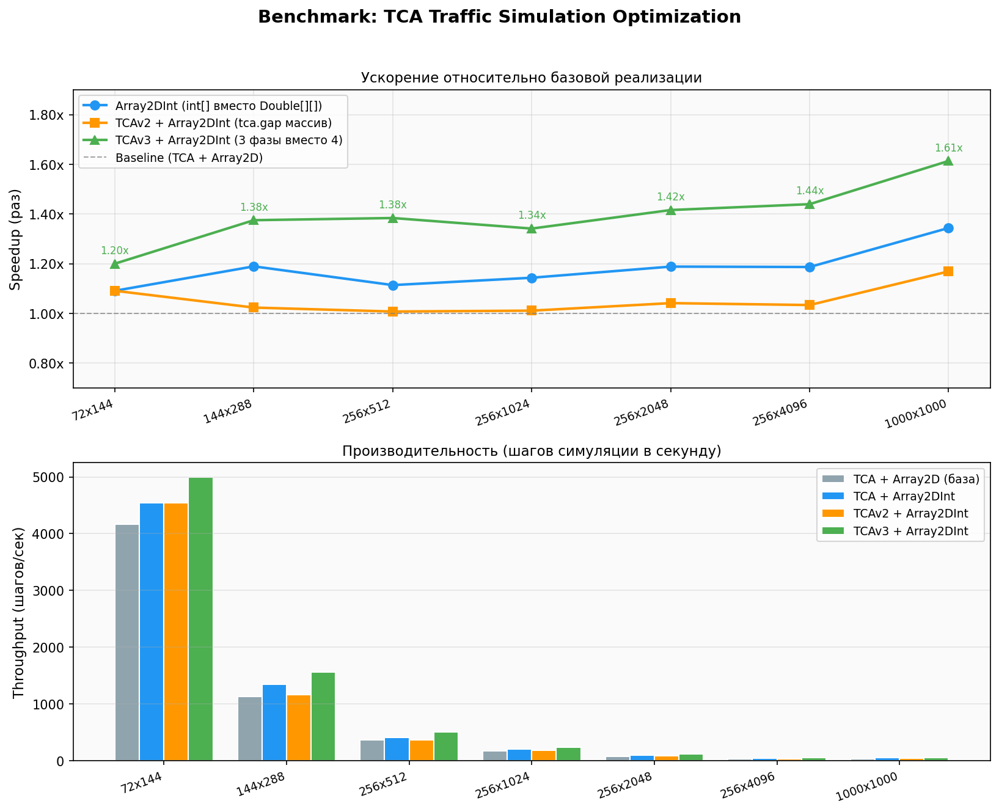
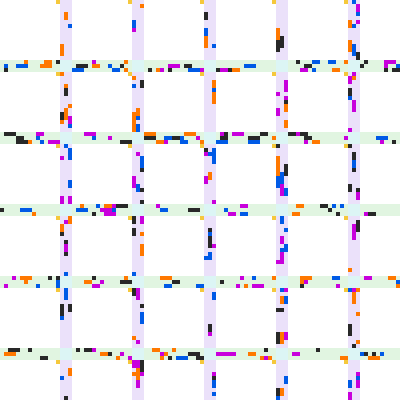

# Симуляция дорожного движения

Команды для запуска:

```
# Билд проекта
javac -d out src/*.java

# Запуск симуляции (default: Array2DInt + TCAv3, 100 steps, scale=4)
java -cp out Main

# Настраиваемый вариант, grid=[double, int], ver=[tca, v2, v3, v4]
java −cp out Main <width=144> <height=288> <steps=100> <seed=0> <scale=4> <grid=int> <ver=v3>

# Запуск визуализатора, можно управлять стрелками с клавиатуры и ставить на паузу на пробел
java -cp out Viewer
```

Результаты бенчмарков:

| Grid | TCA+Array2D (double) | TCA+Array2D (int) | TCAv2+Array2D (int) | TCAv3+Array2D (int) | TCAv4+Array2D (int) | Int× | V2× | V3× | V4× |
| :--- | :--- | :--- | :--- | :--- | :--- | :--- | :--- | :--- | :--- |
| **72x144** | 11 ms (4545/s) | 11 ms (4545/s) | 12 ms (4167/s) | 11 ms (4545/s) | 10 ms (5000/s) | 1.00x | 0.92x | 1.00x | 1.10x |
| **144x288** | 24 ms (2083/s) | 17 ms (2941/s) | 21 ms (2381/s) | 14 ms (3571/s) | 13 ms (3846/s) | 1.41x | 1.14x | 1.71x | 1.85x |
| **256x512** | 54 ms (926/s) | 33 ms (1515/s) | 39 ms (1282/s) | 25 ms (2000/s) | 23 ms (2174/s) | 1.64x | 1.38x | 2.16x | 2.35x |
| **256x1024** | 96 ms (521/s) | 53 ms (943/s) | 62 ms (806/s) | 42 ms (1190/s) | 37 ms (1351/s) | 1.81x | 1.55x | 2.29x | 2.59x |
| **256x2048** | 197 ms (254/s) | 92 ms (543/s) | 107 ms (467/s) | 74 ms (676/s) | 64 ms (781/s) | 2.14x | 1.84x | 2.66x | 3.08x |
| **256x4096** | 388 ms (129/s) | 181 ms (276/s) | 209 ms (239/s) | 148 ms (338/s) | 125 ms (400/s) | 2.14x | 1.86x | 2.62x | 3.10x |
| **1000x1000** | 368 ms (136/s) | 166 ms (301/s) | 188 ms (266/s) | 133 ms (376/s) | 115 ms (435/s) | 2.22x | 1.96x | 2.77x | 3.20x |

График бенчмарков:


Симуляция:

